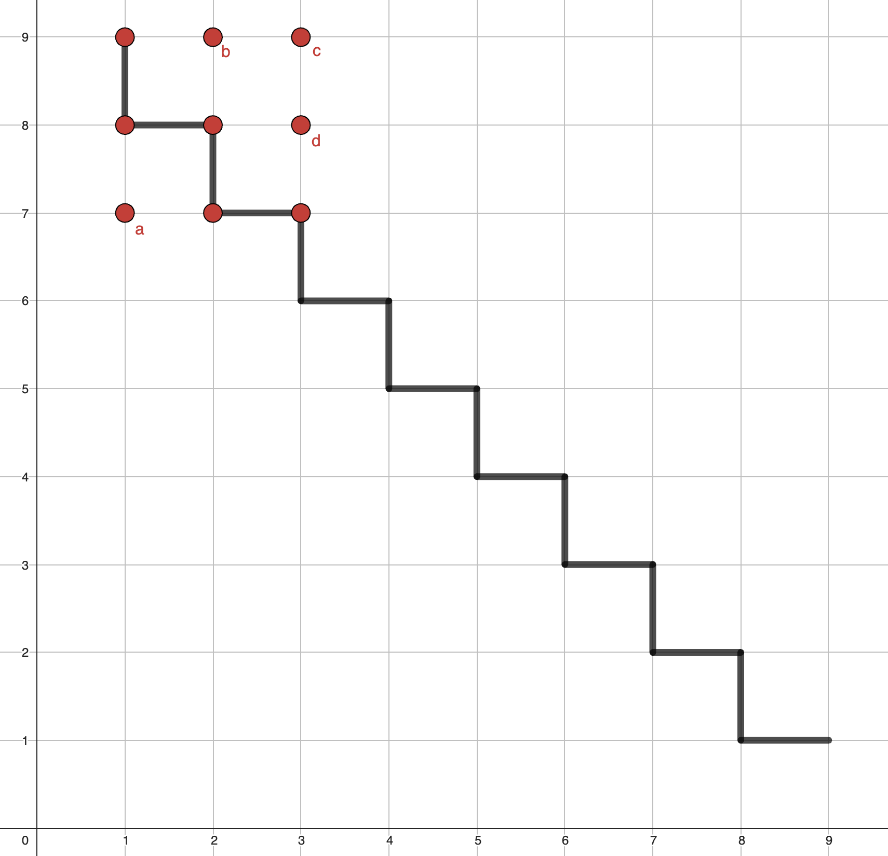
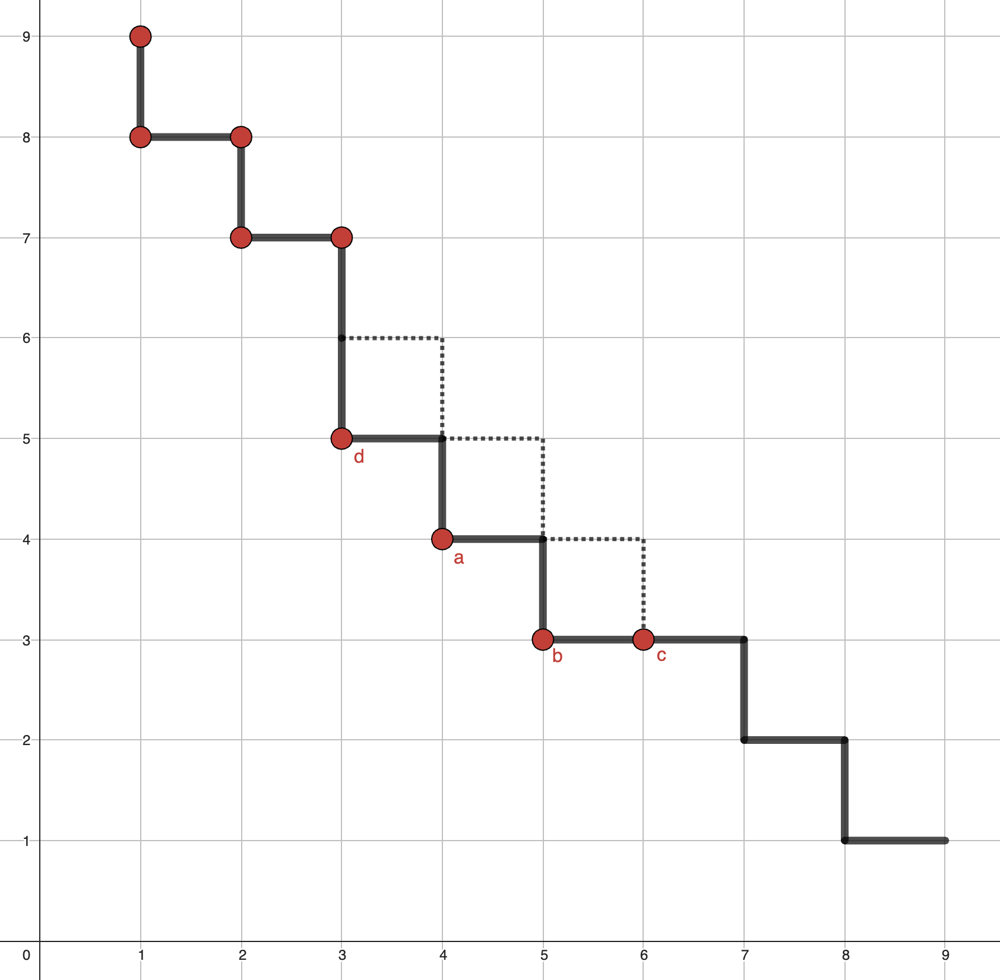

# How does it work:
The explanation of my fastest algorithm is in the last section. However I decided to also add my initial observations and first, a bit slower algorithm to explain better my thought process.
## Some usefull observations
1) According to task description the initial positions of snake and apple, and the size of the screen are unknown. Also, it's given that symmetrical teleportations through borders are possible. This means, we can move starting position of the snake to the origin point (1,1) for the sake of simplicity. Then, we need to move starting point of the apple using the same vector to preserve the original test case.
2) The position of the apple is random, so (for the worst case scenario) we always need to traverse through entire screen for given test case.
3) We can go "out of bounds". With that I mean that if we go n times right, once up and n times left (in any order), we end up one step over the initial position (no matter the real screen size).

## First algorithm - iterative approximation of f(x) = alpha * 1/x
Using above described observations, we assume the starting point of the snake to be at (1,1).
We move in the first quarter of infinite grid. The movement of the snake draws area under curve f(x) = alpha * 1/x, for increasing alpha.
### Idea explanation
The step limit depends on screen size. Our priority should be screens with smalles size (here alpha or less).
In this algorithm, when the whole area under f(x) = alpha * 1/x is visited by the snake, we are guaranteed to find an apple on any screen of size alpha or less.
### Implementation
The list of target positions is computed.
From current position, algorithm plots the shortest possible route to next target position on the list.
This route never includes already visited points. 
When different options are possible, algorithm prioritizes commands "left" and "down" to ensure no 'gaps' are created.  
List of target positions: (1,2), (2,1), (1,6), (6,1), (1,12), (12,1), (1,20), (20,1), ...  
Formally each target position can be described as (1, xn) or (xn, 1), where xn = 2* (1 + 2 + ... n).  
This way, almost exact approximation of f(x) = alpha * 1/x is being drawn, for increasing alpha.
### Complexity
Sadly, doesn't fulfill <=35*screenSize requirement. It is however O(S * sqrt(S)). Maybe even better, but I didn't test it further and instead worked on my second idea.

## Second algorithm - zigzag
This one required some new observations:
1) Let's imagine one rectangular, 2x3 puzzle piece (our screen) lying on the infinite grid. To check whether on the position (2,2) lies an apple, snake could go directly there, or it could go to (4,2) or (4,-4). In fact every position (2*p + 2, 3*q + 2) for integers p, q, is valid.
2) Now, let's take all possible puzzle pieces of size less or equal some choosen alpha. All coordinates occupied by those puzzle pieces are marked as toVisit. The goal is to move some of the coordinates belonging one puzzle piece to different location using rules from first observation. Overall, we need to minimize total number of toVisit. To do that, we need to move as many coordinates as possible to other locations already marked as toVisit by different puzzle piece.

### Approach
Visiting all fields of diagonal zigzag of length n ensures that in both of following test cases apple is always found:  
a) screen: 1xn  
b) screen: nx1  

### Example
3x3 screen can be moved alongside zigzag of length 9 as follows:  
  
  
### Implementation
Let xn = 100 * (1 + 2 + 3 + ... + n)
After creating starting single zigzag of length 8, snake starts spinning around it, clockwise, as tightly to it as possible to not create any gaps, but also does not visit any field twice.
When snake gets to the position, where the current end of main zigzag lies, snake stops the spin and lengthens the main zigzag by xn, where n is number of full loops/spins that snake has drawn.

### Complexity
All values that I tested fulfilled numberOfSteps <= 35 * S condition. Compared to the first algorithm, where it was clear which field will be visited last, in this one, it is hard to determine the worst case. The one thing, I am confidently able to say, is that this algorithm is strictly better than the first one. Even if some tests fail 35 * S condition, I think some slight correction of xn (lengthening of zigzag) could be found, so that the algorithm always fulfills numberOfSteps <= 35 * S. 

